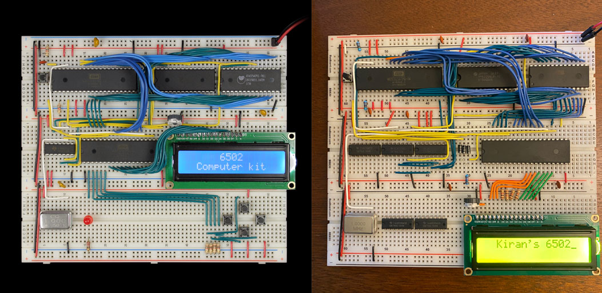
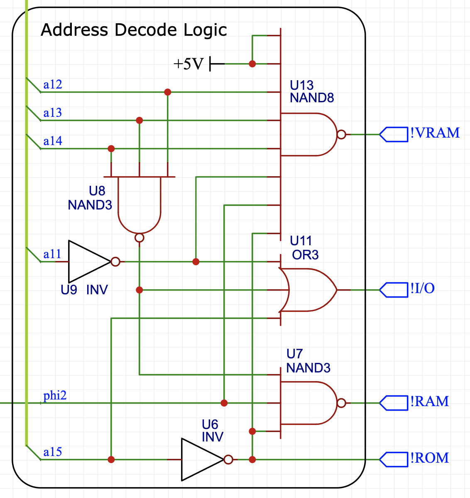
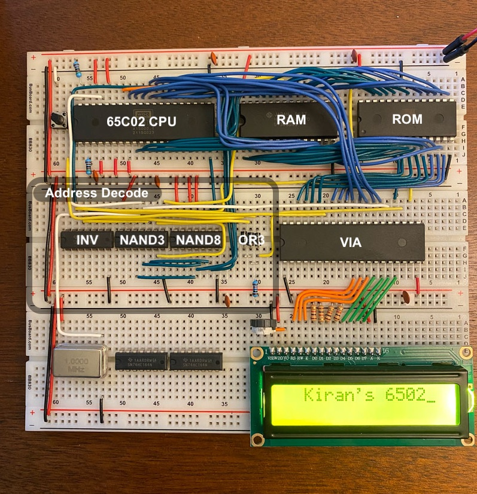
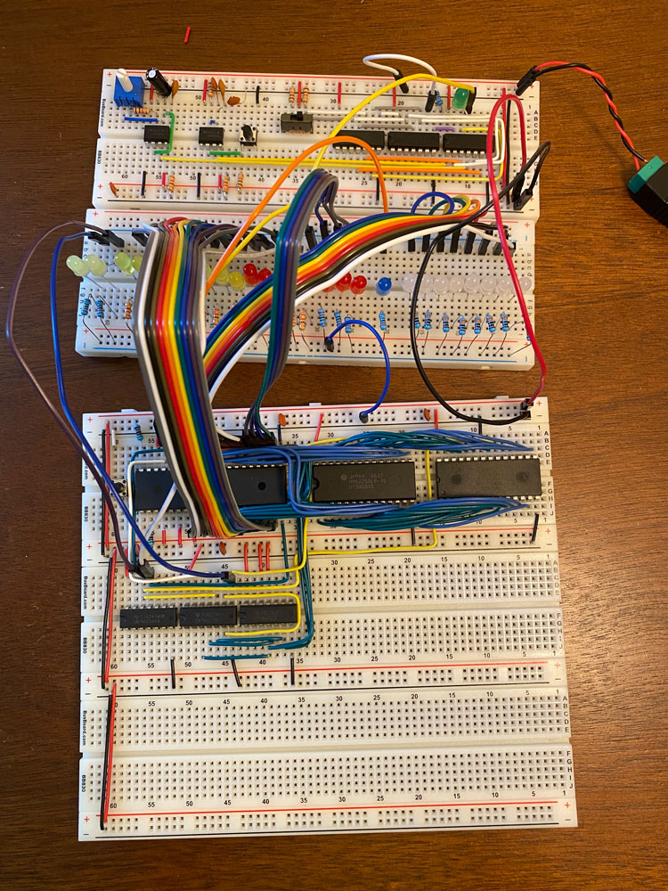

I've been watching a lot of [Ben Eater's](https://www.youtube.com/c/BenEater) videos on electronics and computer architecture lately--I'd highly recommend them. I was inspired to try building his [6502-based breadboard computer](https://eater.net/6502). This will be the first of a series of posts where I go over my design choices and track my progress with the build. Here's what Ben's version looks like on the left, with mine in its current state on the right:

  

For a bit of background, the [6502](https://en.wikipedia.org/wiki/MOS_Technology_6502) is an 8-bit microprocessor that saw use in a huge number of computers and game consoles in the late '70s and early '80s: the Apple II, NES, BBC Micro, Commodore 64, and Atari 2600 all used the 6502! Technically, the version Ben Eater used is the [W65C02S](https://www.westerndesigncenter.com/wdc/w65c02s-chip.php) (or 65C02, for short), an updated version that's still in production. The 65C02 can run higher clock speeds, uses less power, supports some additional instructions, and is fully static. I'll just call it a 6502, since it's very similar in spirit to the original and has (almost) the same opcodes and pinout. 

The 6502 has a 16-bit address space (`0000` to `ffff` in hex), allowing it to natively address 64KB of memory. Ben's design has 16KB of RAM, 32KB of programmable ROM, and uses the remaining address space for the [65C22 Versatile Interface Adapter](https://en.wikipedia.org/wiki/WDC_65C22) (VIA), which is used for input and output devices. In his build above, the VIA is used to output to the LCD and take input from the pushbuttons below (mine is only hooked up to the LCD for now). He used a 1 MHz clock, but I think it should be possible to push it up to 3 MHz and maybe even higher (although this might require some upgrades).

I got Ben's [kit](https://eater.net/shop), but wanted to make a few changes. My goal is to eventually connect a keyboard and monitor to the computer, and maybe even write a basic operating system and text editor for it. The first thing I changed was the memory map. Ben's used the following memory map, which has the advantage of extremely simple address decode logic:
```
0000-3fff: RAM (16KB)
4000-5fff: unused
6000-600f: VIA (2B)
6010-7fff: unused
8000-ffff: ROM (32KB)
```
I wanted to expand the RAM and also add in 2KB of video RAM that could eventually be used for a simple graphics card. I settled on the following memory map:
```
0000-6fff: RAM (28KB)
7000-77ff: VRAM (2KB)
7800-780f: VIA (2B)
7810-7fff: unused
8000-ffff: ROM (32KB)
```
The unused space could eventually be used for extra I/O devices (additional VIAs or maybe a [65C51 ACIA](https://en.wikipedia.org/wiki/WDC_65C51)) if the need arises--but I think this setup will be enough for keyboard input, VGA output to a monitor, and LCD output. The price I paid for the more complex memory map was more complex address decode logic, although I tried to keep it as simple as possible. I found the following configuration, where there are no more than two gates between an input and a chip select signal:



Keeping the depth small minimizes the amount of delay between an address change and a chip select, which is especially important for the RAM, which is only enabled when the clock (`phi2`) is high. Note that all of the chip select signals are active low, denoted by `!`. Here's a labeled picture of the computer above with the address decode logic highlighted:



Since I don't yet have the VRAM set up, the 8-input NAND is unused. I had actually ordered a 3-input OR chip for the VIA control line, but realized I could implement OR with [diodes](https://en.wikipedia.org/wiki/Diode_logic) instead to save some space. The two chips next to the clock on the bottom breadboard are shift registers that I plan to use for the keyboard input--more on that in a later post. I also made some minor layout changes compared to Ben's build: swapping the RAM and the ROM to make the ROM easier to access for programming, and moving the LCD to the bottom board to make room for the larger address decode logic. In order to support both the LCD and keyboard input, I also decided to use the LCD's 4-bit mode instead of the 8-bit mode Ben used, using only 7 I/O lines in total for the LCD. The keyboard input only needs 8 bits, so it should just about work with one VIA!

During the build, I used a [slower clock](https://eater.net/8bit/clock) that could be stopped and single-stepped. In his videos, Ben used an Arduino to monitor the address and data bus for debugging and verification. Since I didn't get an Arduino, I just used a board of LEDs. Here's an in-progress picture with the debug clock, LEDs, and a mess of jumper wires:



The project has been a ton of fun and I can't wait to see how far it will go! In the next posts, I'll write more about my plans for the VGA display, the keyboard input, and the (very basic) software I've written. If you want some additional sources for building a 6502-based computer, I found Garth Wilson's [6502 Primer](http://wilsonminesco.com/6502primer/) a very useful resource in addition to Ben's videos. 


*Update: the computer needed a name (calling it "the breadboard computer" or "my 6502-based computer" got tiring). I ended up settling on the name KiT, since it all started with Bean Eater's kit and because I like putting my name on things. Since developing a new and improved version, this original breadboard version is retroactively the KiT 1, hence the updated title. It also has a nice parallel to the [KIM-1](https://en.wikipedia.org/wiki/KIM-1), a 6502 computer from 1976.*

--------

### Next post: [Part 2]()


