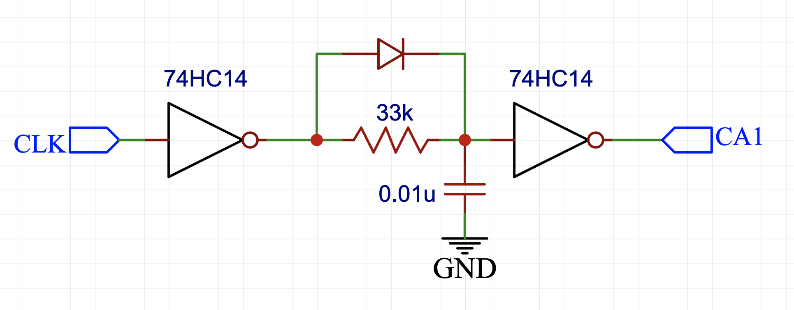
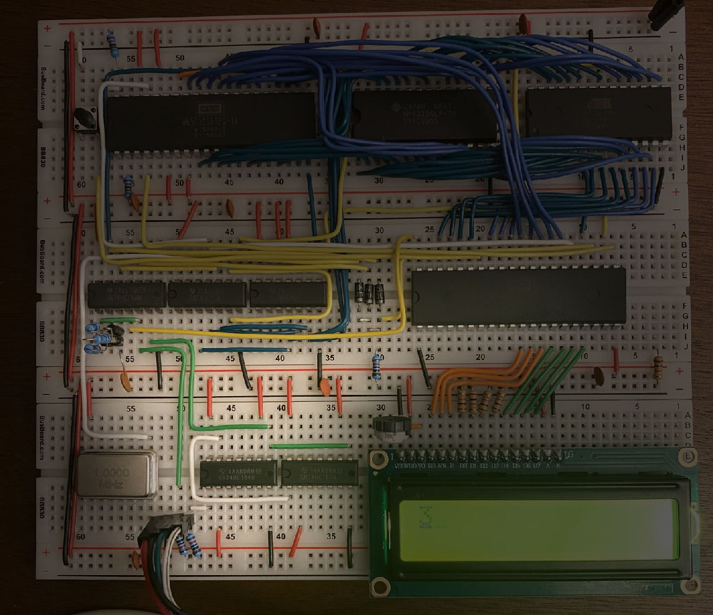
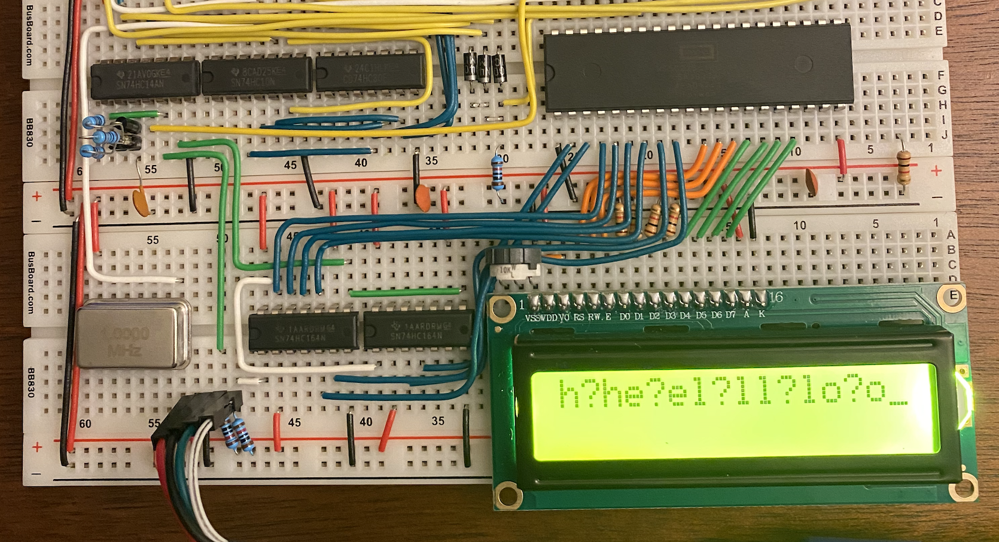
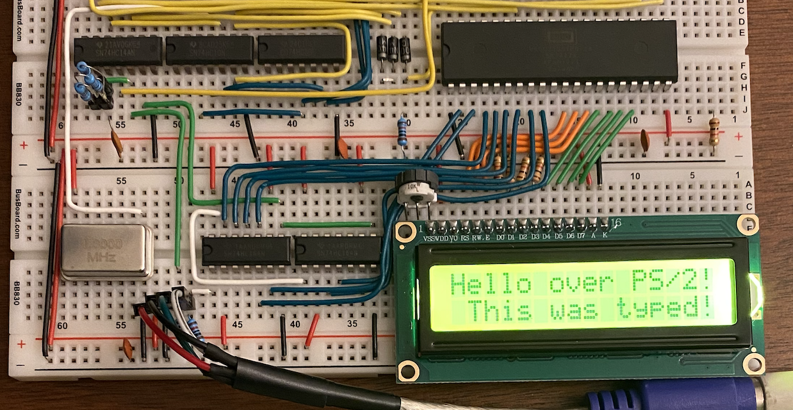

Since posting [Part 1]() of my 6502 build, I've gotten a keyboard hooked up! I'm using an old-school [PS/2 keyboard](https://wiki.osdev.org/PS/2_Keyboard), a connector and keyboard protocol which originated with the [IBM Personal System/2](https://en.wikipedia.org/wiki/IBM_PS/2) in 1987 and was still in use through the 2000s, although USB has largely replaced it. One great thing about PS/2 is that the protocol is very simple and easy to manually interface with (USB would require considerably more work, but [is feasible](http://6502.org/users/andre/hwinfo/usb/index.html)). Ben Eater has [three](https://youtu.be/7aXbh9VUB3U) [great](https://youtu.be/w1SB9Ry8_Jg) [videos](https://youtu.be/dL0GO9SeBh0) on the PS/2 protocol and hooking up a PS/2 keyboard to a 6502 through the [65C22 Versatile Interface Adapter](https://en.wikipedia.org/wiki/WDC_65C22) (VIA).

The specific keyboard I'm using is a [Dell QuietKey SK-1000REW](https://deskthority.net/wiki/Dell_QuietKey) from 1997, but it doesn't really matter. The PS/2 connector just uses four pins: ground, 5V, clock, and data. Data is sent from the keyboard in 11-bit packets: 
- 1 start bit (always 0)
- 8 data bits (least significant first)
- 1 parity bit 
- 1 stop bit (always 1) 

For simplicity, I'm ignoring the parity bit and only looking at the 8 data bits. Bits are sent on the falling edge of the clock, which is usually held high. The keyboard can also receive commands, but I'm not worrying about that either. 

I hooked up the clock and data to two chained 8-bit shift registers (I used the [74HC164](https://www.ti.com/lit/ds/symlink/sn74hc164.pdf) instead of the [74HC595](https://www.ti.com/lit/ds/symlink/sn74hc595.pdf) Ben used). The clock signal has to be inverted to feed into the shift registers. Luckily, I had three leftover inverters in the address control logic! The other two also came in handy for Ben's interrupt generating circuit:

  

The idea behind this circuit is to generate a single rising edge for each data packet using an [RC circuit](https://web.pa.msu.edu/courses/2000fall/phy232/lectures/rccircuits/rc.html) with fast charge. The clock low pulses charge up the capacitor through the diode (after being inverted to high pulses), but the capacitor discharges slowly through the resistor. The values of the resistor and capacitor are just right to keep the output high during the clock pulses and then go low a bit after the packet ends. Conveniently, the [74HC14](https://www.ti.com/lit/ds/symlink/sn74hc14.pdf) has  [Schmitt trigger](https://en.wikipedia.org/wiki/Schmitt_trigger) inputs that convert the analog discharge of the capacitor into a clean digital edge. This is then fed into the CA1 line of the VIA, which is configured to trigger an interrupt, alerting the CPU that a key has been pressed! Here's what the circuit looks like on the breadboard, highlighted:

  

The keyboard clock line is in green, with the keyboard data line in white. Notice my very weird looking 33k resistor--I didn't have one, so I soldered three 100k resistors in parallel to a 2-prong header! I have some 33k resistors on the way to replace this monstrosity, but it's worked great. In this picture, the data output from the shift registers is being ignored. I was just counting interrupts, and the three on the LCD screen shows it worked! Most full keypresses generate three data packets: the key's scan code, then the release scan code, and then the released key's scan code (the scan code table can be found [here](https://webdocs.cs.ualberta.ca/~amaral/courses/329/labs/scancodes.html)). Next, I connected the data lines to Port A of the VIA and printed out all of the scancodes received, after mapping them to ASCII using the table [provided by Ben](https://eater.net/downloads/keyboard.s):

  

Notice the three codes generated by each keypress, e.g., key `h`, release `?`, key `h`. It was then fairly easy to store a few flags indicating whether the shift keys were down and whether the last byte received was a release code. I also added handling of a few special keys like enter, arrows keys, and backspace to move the cursor around. Very pleased with the final product:

  

Here's my 6502 assembly for typing on the LCD, which also includes some subroutines for displaying numbers in hex and in decimal: [lcd_type.s](lcd_type.s). I'm currently working on a rudimentary monitor program inspired by the [Woz Monitor](https://www.sbprojects.net/projects/apple1/wozmon.php) that came with the [Apple I](https://en.wikipedia.org/wiki/Apple_I)--more on that in a future post!

--------

### Previous post: [Part 1]() Next post: [Part 3]()