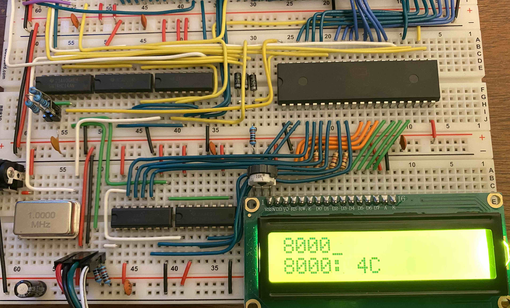
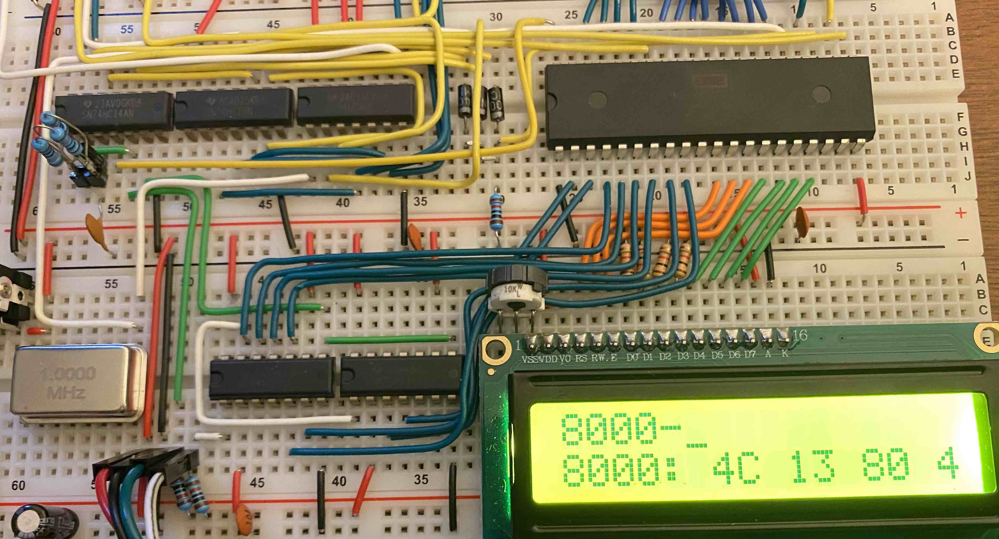
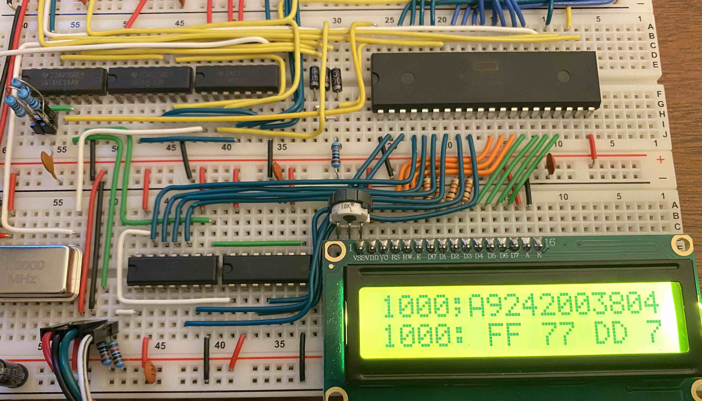
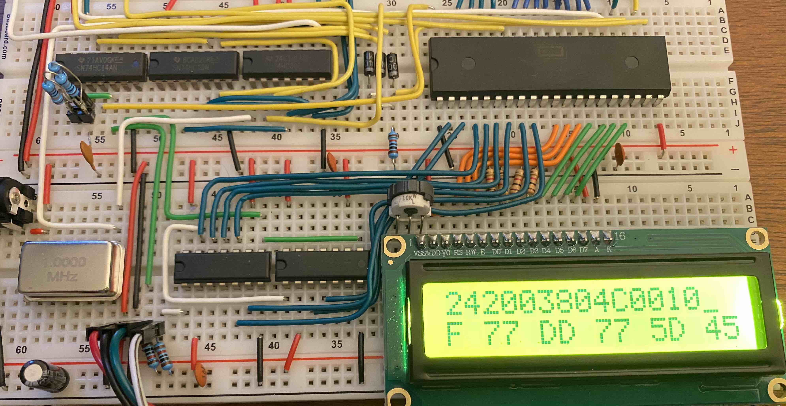
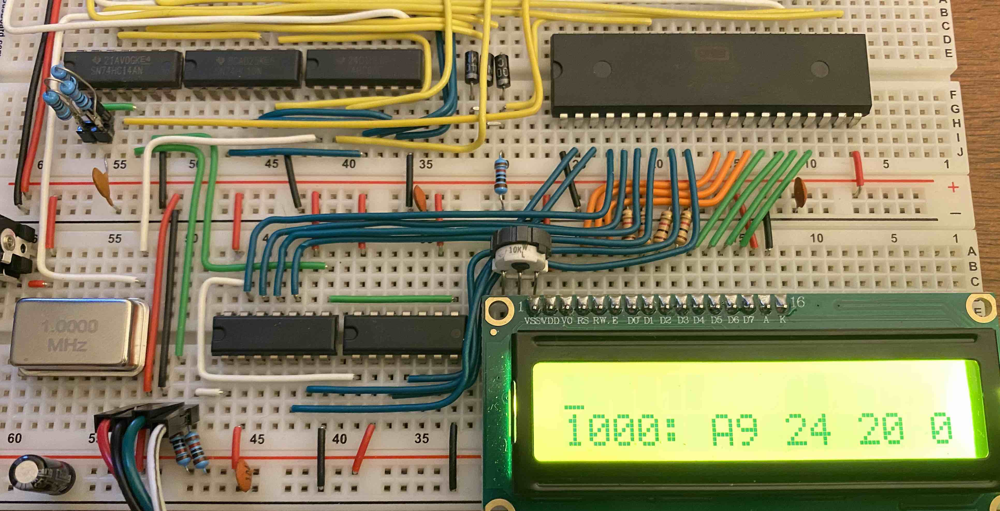
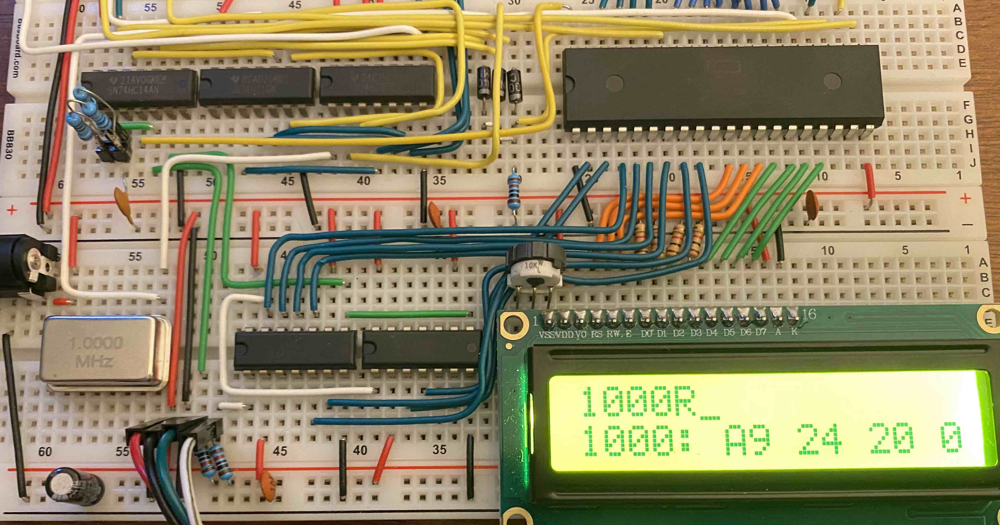
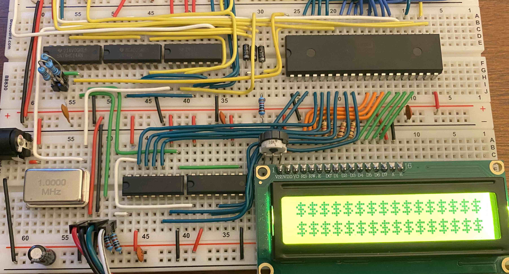

Now that the computer [has a keyboard](), I thought it would be great to be able to write and run code directly on it! To do this, I wrote a very simple [machine code monitor](https://en.wikipedia.org/wiki/Machine_code_monitor) (monitor for short). The idea behind a monitor program is to give the user direct read and write access to memory, so you can look at the actual stored bytes of a program (or data). By writing directly in machine code, you can also enter programs into memory, although this is far from a pleasant programming experience. Finally, a monitor should also let you execute code starting from a particular memory address so you can run the code you painstakingly entered.

One notable historical example is the [Woz Monitor](https://www.sbprojects.net/projects/apple1/wozmon.php) that came with the Apple 1, written by Steve Wozniak. Amazingly, the Woz Monitor uses only 256 bytes of ROM! My monitor, which I'm calling LCDMon (since it is designed for the computer's 2-row character LCD), takes almost 1KB due to more CPU-intensive keyboard and display I/O (and my lack of assembly expertise). 

LCDMon supports four operations: (1) read one byte, (2) read eight bytes, (3) write bytes, and (4) run. All commands are typed on row 1 of the LCD, while outputs from the last command are displayed on row 2. To read one byte, you simply type in the hex address to read from (`0000`-`ffff`):


  


  To read eight bytes, you follow the starting address with a hyphen (page down on the keyboard scrolls the LCD to the the rest of the eight bytes):

  

  The address `8000` is the beginning of ROM, where I've placed a jump table: `4c` is the jump opcode, and the first entry of the table jumps to address `8013` ([little-endian](https://en.wikipedia.org/wiki/Endianness), so the `13` comes first). Reading works! 


  To write bytes starting at an address, you write the address followed by a semicolon and then the bytes to write. To run code starting an an address, you follow the address with an `R`. To give you a sense of how this works under the hood, here's a small snippet of LCDMon that handles writing entered data:

  ```plaintext
write_byte:                       ; write data to MON_ADDR, starting with the byte at
                                    ; TEXT_BUFFER+y+1 (TEXT_BUFFER+y is ;). x initialized to 0
    iny
    lda TEXT_BUFFER,y               ; load the next char into A
    beq enter_reset                 ; if it's null, done writing
    cmp #" "                        ; check if it's space
    beq write_byte                  ; if it is, consume it and move on
    jsr parse_hex_byte              ; otherwise, parse the next byte, incrementing y
    sta (MON_ADDR,x)                ; write the byte where mon addr is pointing (x is 0)
    inc MON_ADDR                    ; increment address to write to
    bne write_byte                  ; check if 0 after incrementing (if 0, need to carry)
    inc MON_ADDR+1                  ; if MON_ADDR became 0 after inc, need to carry to hi byte
    jmp write_byte                  ; loop to write next byte
```
The full source code of LCDMon is available here: [lcd_mon.s](lcd_mon.s). To test if LCDMon was working, I used the table of [6502 opcodes](https://www.masswerk.at/6502/6502_instruction_set.html) to write a program at address `1000` that would fill the LCD with dollar signs (ASCII hex `0x24`):

```plaintext
a9 24       lda #$24        ; load the ASCII code for a dollar sign into the A register
20 03 80    jsr write_lcd   ; jump to a subroutine in ROM to print A register contents
4c 00 10    jmp $1000       ; loop
```

The whole program is just 8 bytes long!  Here's what writing this code looks like (notice I previously displayed the contexts at `1000`, which is just garbage in RAM):

  

  


We can check that the program was written successfully by running `1000-`:

  

And finally run it:

  

  

Woooo! In theory, any code could be entered by hand like this, but in practice it's extremely tedious and prone to errors. Since writing LCDMon, I've been working on a number of hardware upgrades, most notably a graphics card! More on that soon.

### Previous post: [Part 2]() <span style="float:right">Next post: [Part 4]()</span>
