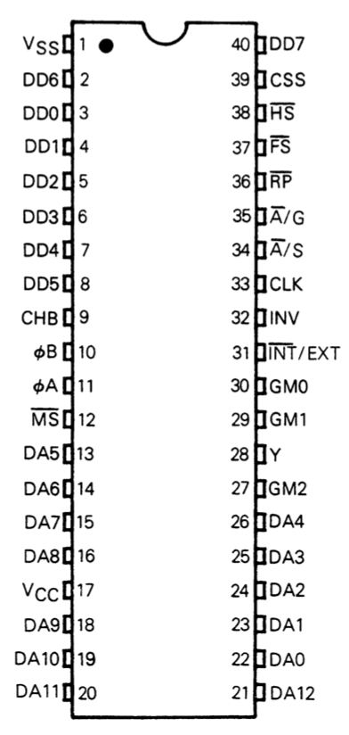
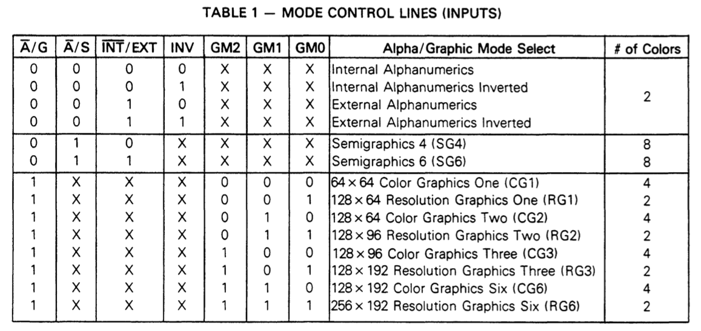
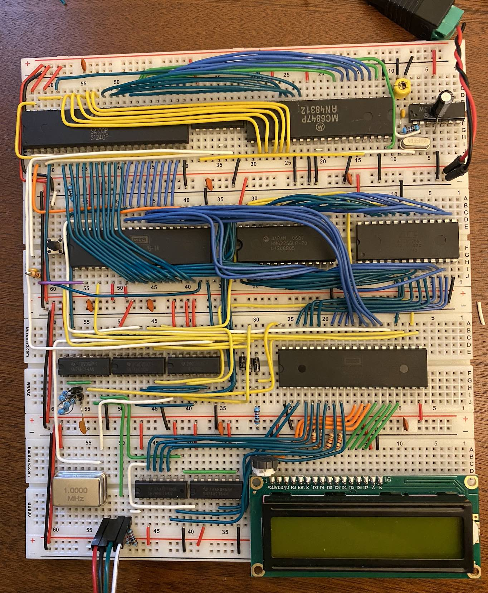
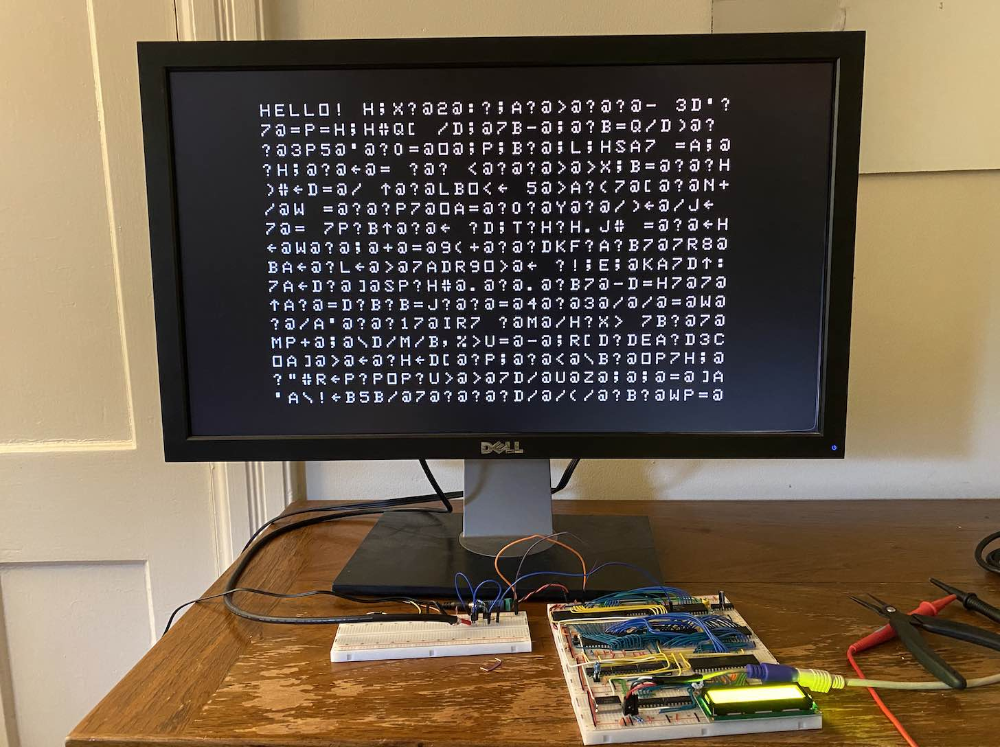
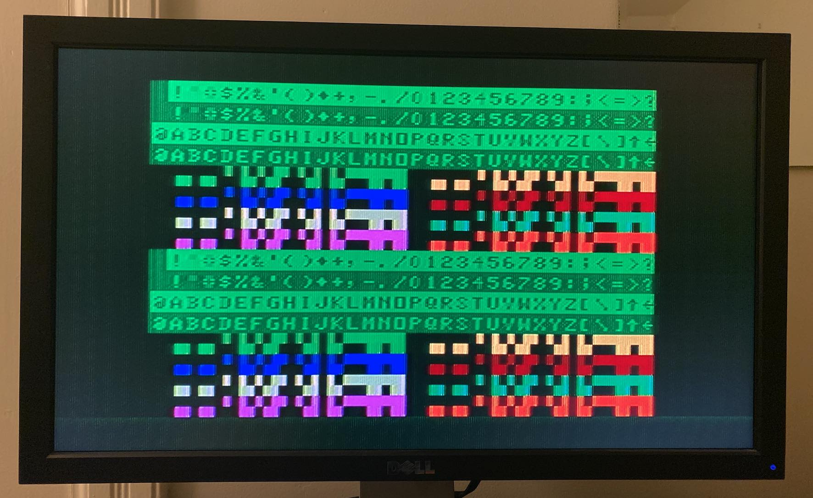
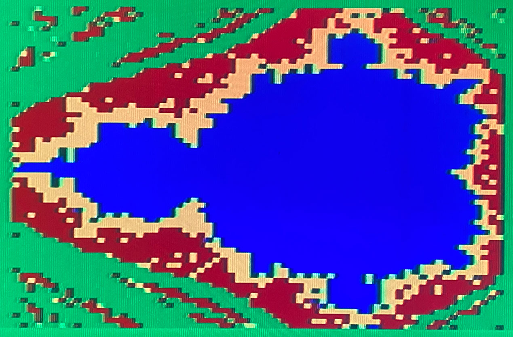
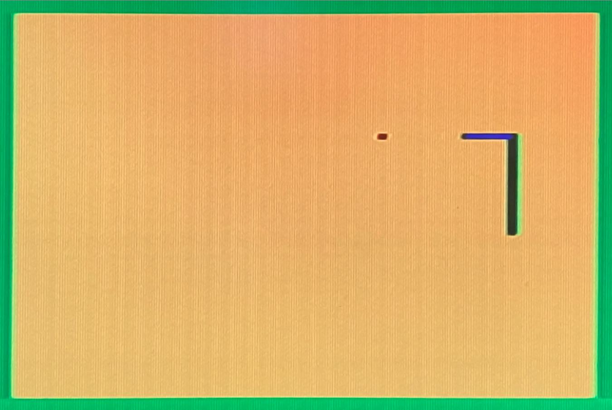
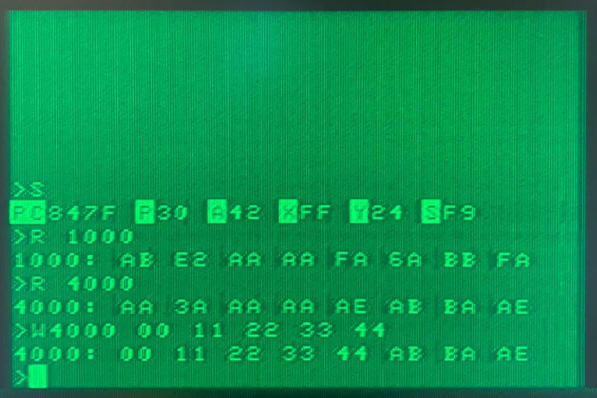

So far in this project, I've [built a simple computer](), [given it a keyboard](), and [written a machine language monitor for it](). However, only being able to see outputs on the small character LCD was not very fun, so it's time for a serious upgrade. I decided to add a graphics card! This is the first major departure from [Ben Eater's build](https://eater.net/6502) that I've mainly been following so far. 

There are a number of options for adding graphics to an 8-bit computer. Some people have used [custom FPGAs](https://www.skrasser.com/blog/2020/04/16/graphics-for-the-homebrew-6502-computer/) or [custom TTL circuits](https://hackaday.io/project/174865-configurable-video-output-for-6502-computers). Ben Eater actually has a [video series and kit](https://eater.net/vga) for a simple VGA card. If you're interested in seeing a full nuts-and-bolts VGA build, I would highly recommend [James Sharman's VGA series](https://youtu.be/K658R321f7I). 

To keep things simple, I decided to go with an old [video display controller](https://en.wikipedia.org/wiki/Video_display_controller), the [Motorola MC6847](https://en.wikipedia.org/wiki/Motorola_6847), which was most notably used in the [TRS-80 Color Computer](http://www.trs-80.org/color-computer-1/) released in 1980. Other possible 8-bit video controllers include the [Texas Instruments TMS9918](https://en.wikipedia.org/wiki/Texas_Instruments_TMS9918) and its successors, the [Yamaha V9938](https://en.wikipedia.org/wiki/Yamaha_V9938) and [Yamaha V9958](https://en.wikipedia.org/wiki/Yamaha_V9958); the [MOS VIC](https://en.wikipedia.org/wiki/MOS_Technology_VIC) used in the [Commodore VIC-20](https://youtu.be/yg04GyhS3ss); the [MOS VIC-II](https://en.wikipedia.org/wiki/MOS_Technology_VIC-II) used in the [Commodore 64](https://youtu.be/BpXFB8ZEH30) and [128](https://youtu.be/wzMsgnnDIRE); and many, many more. 

The problem with all of these vintage ICs is that they're no longer made, so you have to resort to buying them used (your mileage may vary). Some of these are also quite expensive ($25-$100 on eBay for a Yamaha V9938, Yamaha V9958, VIC, or VIC-II). By far the cheapest options are the MC6847 and TMS9918, both of which can be found for under $5. I was much more willing to spend $5 than $25 on a used chip from 1980 that might not work, so I got an [MC6847](MC6847-video.pdf) and its companion chip, the [MC1372](MC1372-tv.pdf).

The MC6847 generates a video signal by sweeping through memory addresses and interpreting the values stored there as characters (in text modes) or pixel groups (in graphics modes). Here's the chip's pinout:

  

  DA0-DA12 are the address lines into video RAM and DD0-DD7 are the data lines where the video RAM responds with the data to display. The mode control lines (A/G, A/S, INT/EXT, INV, and GM0-GM2) are used to select the display mode, which determine how much memory is required, how bytes are interpreted, and what can be displayed. Here are the 14 modes of the MC6847:

  

The video signal is output as three signals, luminance (Y), red chrominance (ɸA), and blue chrominance (ɸB) (usually called [YPbPr](https://en.wikipedia.org/wiki/YPbPr)). These signals can be combined into a [composite video signal](https://en.wikipedia.org/wiki/Composite_video), which is where the MC1372 comes in. Along with an external oscillator, the MC1372 provides a clock at the correct frequency for the MC6847 and can combine the outputs of the MC6847 into a color composite signal that many monitors and TVs can display (if they aren't too recent). It's also possible to [directly amplify the YPbPr signals](https://youtu.be/rymjY1cT6DE) and use [component video](https://en.wikipedia.org/wiki/Component_video), but I haven't tried that yet.

In addition to the MC6847 and MC1372, the final piece of the puzzle to add video to the breadboard computer is the video RAM (VRAM). The main challenge with VRAM is that both the CPU and the video display generator need to access it, and they run at different clock rates (3.579545 MHz for the video chip and 1 MHz for the CPU). One option would be to use the video clock for the CPU and figure out some way to share the address and data lines between the CPU and video chip (for instance, running the CPU at half the clock rate and alternating control between the two chips--this is more or less what the Commodore 64 did). For simplicity, Ben Eater's [VGA card](https://eater.net/vga) only allows the CPU to run during the blanking interval of the video signal, when the video chip doesn't need access to VRAM--but this wastes about 70% of CPU cycles.

I decided to take a different approach: [asynchronous dual-port RAM](https://www.renesas.com/us/en/products/memory-logic/multi-port-memory/asynchronous-dual-port-rams). These types of RAM chips have two independent sets of address and data lines and allow simultaneous access on both sets (with one caveat, explained below).The specific dual-port RAM I went with is the 2KB [IDT7132](https://www.renesas.com/us/en/document/dst/713242-datasheet). One port is hooked up to the 6502 CPU and the other to the MC6847--you can see it in the top left:

  

The small caveat: simultaneous reads to the same address are fine, but a write can fail if the other port is accessing the same address. In this case, the writing port gets a busy flag. Since only the CPU writes to VRAM, I made the busy flag pause the CPU using its RDY pin until the video chip has moved on to reading another address--this has worked perfectly, and only rarely pauses the CPU for a few microseconds. 

After hooking up the VRAM and the MC1372 clock to the MC6847, I needed to amplify the video signal being generated by the MC6847. To begin with, I just amplified the luminance signal to get a black and white image. Since I know nothing about analog circuitry, I followed the amplifier schematic in [this blog post](https://pmig96.wordpress.com/2020/07/15/mc6847-test-circuit/). The result was glorious:

  

  I have since wired up all of the color mixing circuitry and switched over to the color composite amplifier circuit in the [MC6847 datasheet](MC6847-video.pdf). Here's the text and semigraphics modes in all their 8-color beauty:

  

  After adding some DIP switches to let me switch between graphics modes, I've also worked on some graphical programs, including a [Mandelbrot Set](https://en.wikipedia.org/wiki/Mandelbrot_set) visualization (in four-color 64x64 CG1 mode):

  

  And the game [Snake](https://en.wikipedia.org/wiki/Snake_(video_game_genre)):

  

The most useful program I've written using the graphics card is a more powerful machine language monitor in text mode:

  

The new and improved monitor even allows loading programs into RAM over a serial port--more on that in the next post!

--------

### Previous post: [Part 3]()  Next post:  [Part 5]()

