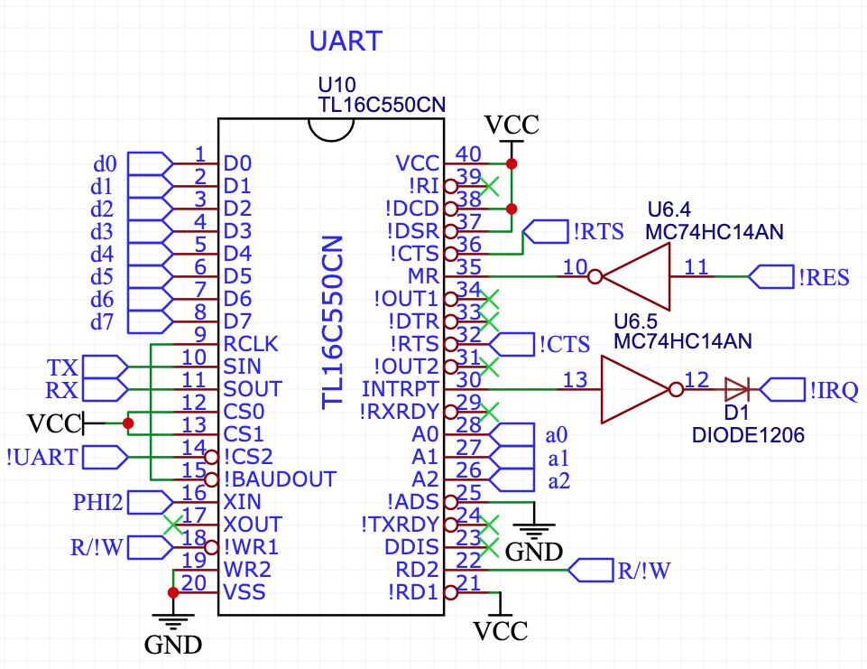
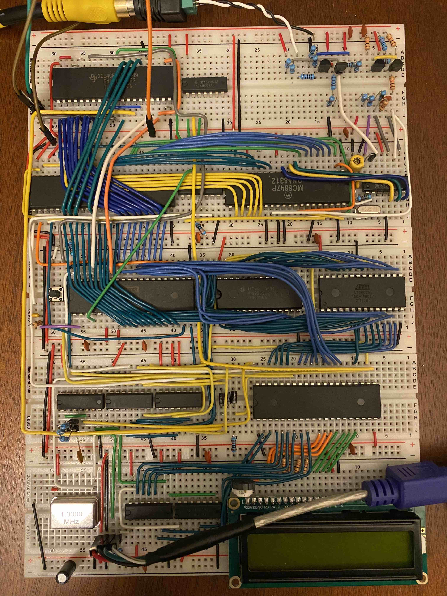

After adding a [graphics card]() to my 6502-based computer, the next step was to make programming it easier. Up to this point in the build, I had to remove the ROM chip and manually flash it with my [TL866II Plus Programmer](https://www.jameco.com/z/TL866II-Plus-Jameco-ValuePro-USB-High-Performance-Programmer_2297823.html) each time I wanted to run a new program. This made debugging quite tedious. The solution: a serial input/output port that would allow me to connect my laptop to the 6502 and send data back and forth. That way, the 6502 could load a program over the serial port directly into RAM and execute it. I already had a USB to UART adapter, so I did some research and selected the [16C550](https://www.ti.com/lit/ds/symlink/tl16c550c.pdf?ts=1680754339129&ref_url=https%253A%252F%252Fwww.ti.com%252Fproduct%252FTL16C550C) as a good option for a [UART](https://en.wikipedia.org/wiki/Universal_asynchronous_receiver-transmitter) chip available in DIP form.

Just recently, Ben Eater actually released a [few](https://youtu.be/oLYLnb7kpLg) [videos](https://youtu.be/zsERDRM1oy8) and a [kit](https://eater.net/6502) for adding an RS-232 serial port to his 6502 kit. I might have gone this route had it been released 6 months earlier, but it's probably good that I got the experience designing and testing my own approach. Ben's version uses the [W65C51 ACIA](https://www.westerndesigncenter.com/wdc/documentation/w65c51s.pdf) chip, which  unfortunately has a [known bug](http://forum.6502.org/viewtopic.php?f=4&t=2543&start=30). It's possible to work around it, but this dissuaded me from the 65C51.

The 16C550 has a bunch of neat features, including a software-selectable baud rate and 16-byte receive and transmit queues. It can either generate interrupts when data arrives or operate in polled mode where the CPU repeatedly checks whether data is available. 

Here's how the chip fits in with my build:



The data and address lines are driven directly by the data and address bus. I allocated addresses 7820-782F for the UART and added address decode logic to send the !UART signal low when any of these addresses are accessed. This allows reads and writes<sup><a href="#footnote-1">1</a></sup> to the UART registers (including mode configuration registers and the receive/transmit buffers). Using the 1MHz system clock (signal PHI2 in the diagram above), I found a way to get a standard baud rate, 4800 (480 bytes/s with the serial port in [8N1](https://en.wikipedia.org/wiki/Serial_port#Conventional_notation) mode): the 16C550 allows you to set a divisor of the clock rate to set 16 times the desired baud rate. So, with 1,000,000 clock cycles per second, a divisor of 13 gives a baud rate of 1,000,000 / (13 * 16) = 4808--definitely close enough to 4800 to work! 480 bytes/s is incredibly slow by today's standards, but good enough for uploading programs to the breadboard computer!

I wrote a Python script to transmit a program from my laptop to the UART, which starts out by sending the file size, a [simple checksum](https://en.wikipedia.org/wiki/Fletcher%27s_checksum), and the start address of the program. It then sends the actual program bytes, which a loading program on the breadboard computer copies into RAM starting at the start address. It can then verify that the checksum matches and run the program in RAM after it has received the declared number of bytes! Here's some of the 6502-side code that reads in the program into `target_addr`:

```java
  stz checksum_addr
  stz checksum_addr+1        // initialize checksum

  ldx #0                     // store num bytes copied low byte in X
  stz zp.B                   // store num pages copied in zp.B

  ldy #0                     // store 0 in y for indirect addressing               

  mov2 target_addr : zp.C    // store the target address in zp.C,D

loop:
  jsr uart.read_byte         // get a byte
  sta (zp.C),y               // store the byte in the pointer in zp.C,D

  clc
  adc checksum_addr
  sta checksum_addr          // update the first checksum byte
  clc 
  adc checksum_addr+1
  sta checksum_addr+1        // update the second checksum byte

  inc zp.C                   // increment the pointer
  bne no_carry               // if it doesn't become 0, no need to carry
  inc zp.C+1                 // if it does become 0, carry to high byte
no_carry:
  inx                        // increment num bytes copied
  bne no_x_carry
  inc zp.B                   // if carrying, increment num pages copied
no_x_carry:
  cpx n_addr
  bne loop                   // if x doesn't match file size low bytes, still copying
  lda zp.B
  cmp n_addr+1
  bcc loop                   // if pages copied < filesize high byte, still copying

``` 

I added a load command (`L`) to the monitor program that also prints out A, B, C (address, bytes, checksum) in hex:


This indicates a 0x77 (119) byte  program was loaded to address 0x1000 with checksum 0xA53 (which agrees with the transmitted checksum). Pressing R will run the program. (See a future post for why there's a "Save" option--this image is from a very recent version of the 6502 computer with some extra upgrades.) Here's what the breadboard computer looks like with the 16C550 chip at the very top left:




Notice the three green address lines and eight blue data lines brought up from the VRAM chip right below. The four wires heading off the top left of the breadboard go to my USB-to-UART adapter and then into my MacBook! Adding the ability to quickly load programs without flashing the ROM chip has enabled a much faster build-test-debug development cycle, making software development way more enjoyable.

I'll be writing soon about a very exciting step in the project: going from breadboard to PCB!


--------

### Previous post: [Part 4]()  <span style="float:right">Next post: [Part 6]()</span> 
</br>
<small><sup id="footnote-1">1</sup>Unfortunately there's a subtle bug in my design that makes writes to the somewhat unreliable, caused by the fact that writes to the 16C550 are triggered only by the rising edge of the !WR1 signal. In contrast, writes to my HM62256 RAM chip can be triggered either by the rising edge of R/!W or by the rising edge of the active low chip enable signal, whichever comes first. The 65C02's R/!W signal during a write cycle goes high at roughly the same time as the address and data lines stop being valid. In order to properly clock a write, you need to make sure the write occurs at the falling edge of the PHI2 clock, which happens before R/W! goes high and while the address and data lines are both valid. The RAM works by having the RAM chip enable signal be disabled whenever PHI2 is low, so the write gets triggered at the right time. For the 16C550, you therefore shouldn't just use the CPU's R/!W signal to control a write. Instead, you need a signal that is low when R/W! is low <em>and</em> PHI2 is high to plug into the 16C550's !WR1. My current version is still buggy: writes sometimes succeed, but it depends on what the address lines do after the write to the 16C550. I've managed to get the small number of writes I need to load programs working consistently, but I need to fix this issue in a future version.</small>


