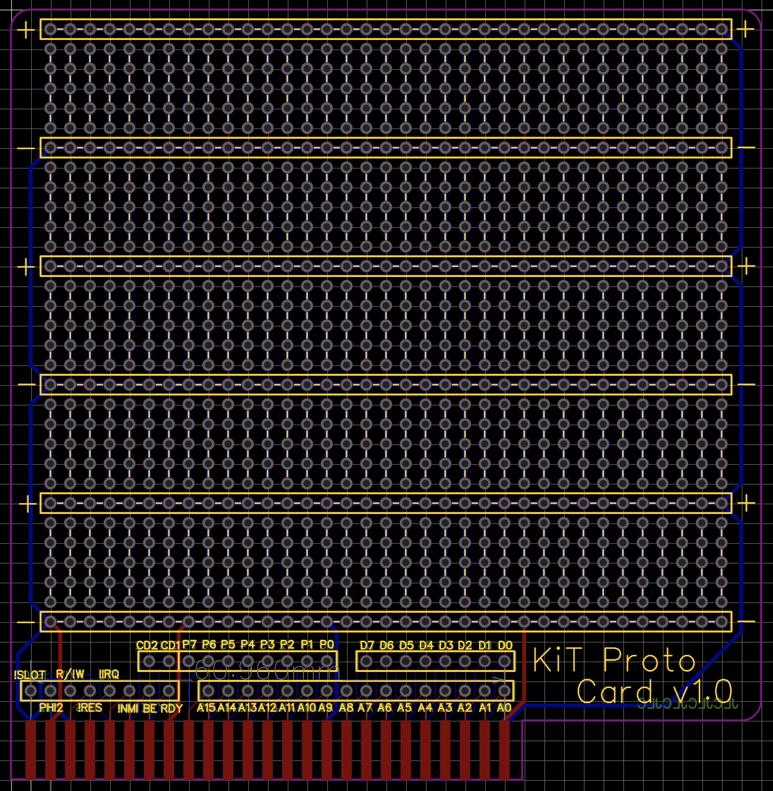

In the [last post](), I described adding serial I/O to the KiT 1; that was the last major hardware addition I made to the breadboard-based version. The next step was a big one: going from breadboard to printed circuit board (PCB). After seeing [James Sharman](https://www.youtube.com/channel/UCeRXQ_B5WZD3yjPly45myvg)'s incredible success with his pipelined 8-bit CPU, I decided to use [EasyEDA](https://easyeda.com) as my PCB design tool. I settled on a modular design, where the core functionality would be included in the main board (CPU, RAM, ROM, UART, VIAs) and additional features would be provided trough 5 expansion slots (graphics, sound, storage, etc). After a lot of time spent fiddling around with positioning and tons of manual wiring, here's what my main board design ended up looking like:


The main board of the new KiT 2 is overall quite similar to the breadboard KiT 1, with few exceptions:
- I removed the LCD and graphics card, since these would be handled by expansion cards (in fact, I haven't bothered with an LCD now that I have a good graphics card).
- There is one more VIA on the KiT 2 (I call the extra two ports C and D). On the KiT 1, VIA port A was used for keyboard input and port B was used for the LCD. On the KiT 2, port A is still used for keyboard input, but port B is simply exposed with a pin header for versatility (like GPIO pins on a Raspberry Pi). Ports C and D are tied into the expansion slots: C is wired to slot 1, while D wired to slots 2-5. The idea is to use slot 1 for cards that need continuous access to a dedicated port, while slots 2-5 can share a single port for intermittent use. I'm using slot 1 for the graphics card, where port C controls the graphics mode. It would be possible to just use port D for this, but that would require some additional latching and dedicated address space. This solution makes controlling graphics modes very simple!
- I replaced the address control logic chips with two programmable [GAL](https://en.wikipedia.org/wiki/Generic_Array_Logic) chips (nice blog post about GALs [here](https://justanotherelectronicsblog.com/?p=458)), one to control all of the chip select lines for the main board (the Main GAL) and one to control the slot select lines (the Slot GAL). The really nice feature of GALs is that I can reprogram them using my EEPROM programmer to rearrange the address space on the fly. You just specify the pin logic in a `.pld` file, assemble it into a `.jed` file using [Galette](https://github.com/simon-frankau/galette), and flash that to the GAL chip using [minipro](https://gitlab.com/DavidGriffith/minipro/). Here's a snippet of my Main GAL `.pld` file showing the syntax for specifying I/O logic (note: `*` is `and`, `+` is `or`, and `/` is `not`; the `.pld` file also lets you name the pins, which I've done here):
  ```text
  ROM  = a15 * a14 + a15 * a13 + a15 * a12
  RAM  = PHI2 * /a15 * /a14 + PHI2 * /a15 * /a13
  VIA1 = /a15 * a14 * a13 * a12 * a11 * /a10 * /a9 * /a8
  VIA2 = /a15 * a14 * a13 * a12 * a11 * /a10 * /a9 * a8
  UART = /a15 * a14 * a13 * a12 * a11 * /a10 * a9 * /a8
  ```
- I decided to use surface-mount components (except the main chips, which are all DIP). Since I was expecting to hand-solder everything, I picked one of the larger standard component sizes: 1206. This ended up working out well enough--they were small enough to make layout possible, but also big enough to hand-solder without too much hassle. 

The board layout itself was pretty challenging, especially the routing (which is [NP-hard](https://dl.acm.org/doi/abs/10.1145/800139.804562), after all). Since I knew nothing about PCB design, I did a bunch of internet digging and tried to follow these basic guidelines:
- four layers: power and ground planes in the middle and two signal layers on the outside
- thin signal traces, thick power traces
- minimize number of vias
- only 45-degree angles for traces (no right angles)
- top layer has mostly horizontal traces, bottom layer has mostly vertical traces.

I'm not sure exactly how long all the routing took, but it was definitely many hours. In parallel, I was also working on the graphics card, since that would be my primary output from the KiT 2. I used the same basic design as the KiT 1's graphics card, but designed it to fit into expansion slot 1, added two more DPRAM chips (6K total!) so I'd be able to use all video modes supported by the MC6847, and tied in the video mode lines into port C in the expansion slot so that I could control video modes programmatically rather than with DIP switches as in the KiT 1. Here's the final PCB layout for the graphics card:


Finally, I made a prototyping card that would let me develop other expansion cards without needing to get a new PCB manufactured each time:



Once the designs were done, I placed an order with [JLCPCB](https://jlcpcb.com) and ordered all the components (mostly from [Mouser](https://www.mouser.com) and [Jameco](https://www.jameco.com)), although I got some of the obsolete components from random sellers on eBay (like the GALs). The boards turned out looking great! Here are some pictures at various stages of soldering and fit-testing:


After installing of the chips, I wrote a simple program to blink an LED hooked up to port B. It was alive!


I eventually got around to soldering up the graphics card too:


After debugging a bunch of issues listed below, I was able to get it working and take advantage of the newly available 6K graphics modes:


Of course, my first-try designs had a bunch of issues, although I've been able to work around them reasonably well. Here are the hardware bugs I know of in the KiT 2:

| Known bugs      | Current patch  | Eventual fix |
| ----------- | ----------- | -------------- |
| RX and TX are the wrong way around for the UART header      |  Made an adapter      |     Swap RX and TX          |
| UART LEDs are on when they should be off   | Ignore the LEDs        | Remove UART LEDs          |
| The PS/2 connector is wired backwards/upside-down   | Made an adapter        |     Fix the wiring      |
| The power jack ground is wired wrong   | Soldered a jumper        |  Fix the wiring         |
| The UART write signal is wrong  (some writes fail; see [this footnote]())   |   Avoid UART writes   |   Add R/!W as an input to Main GAL and gate the UART write signal based on it        |
| Graphics card: !BUSY pins on all 3 DPRAMs are missing pull-up resistors   | Soldered resistors to the pins of chip U9        |  Add SMD pull-up resistors    |

If you want to check out the full schematic for the main board, [here it is](kit-2-schematic.svg), but beware that it includes the bugs listed above.

Since getting the KiT 2 working, I've made two more expansion cards: a 256KB flash drive for persistent storage and a sound card using an [ARMSID](https://retrocomp.cz/produkt?id=2). I've also written an emulator for the KiT 2! More on these developments in future posts.

--------

### Previous post: [Part 5]() <span style="float:right">Next post: [Part 7]()</span>


