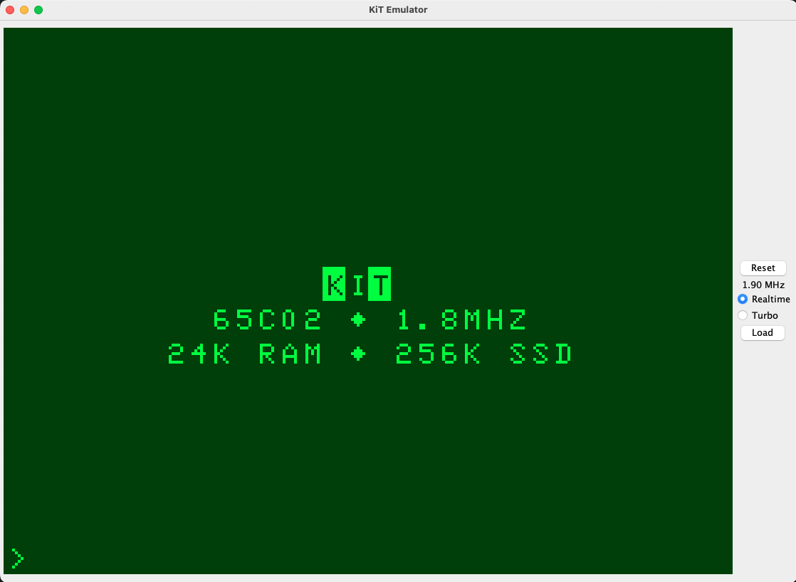
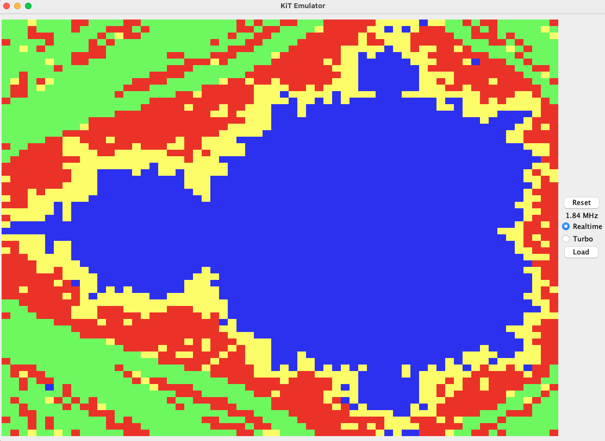
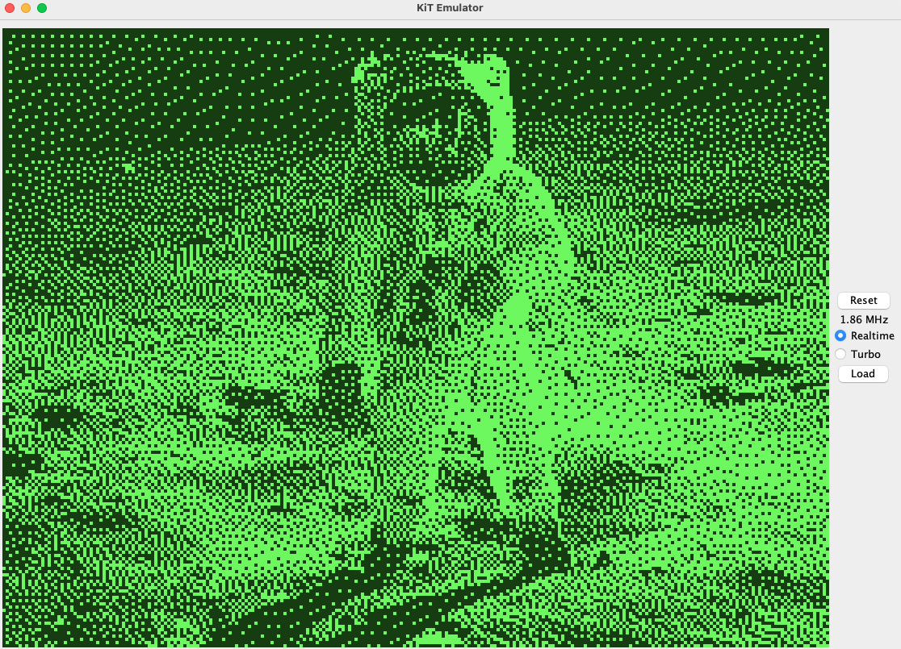
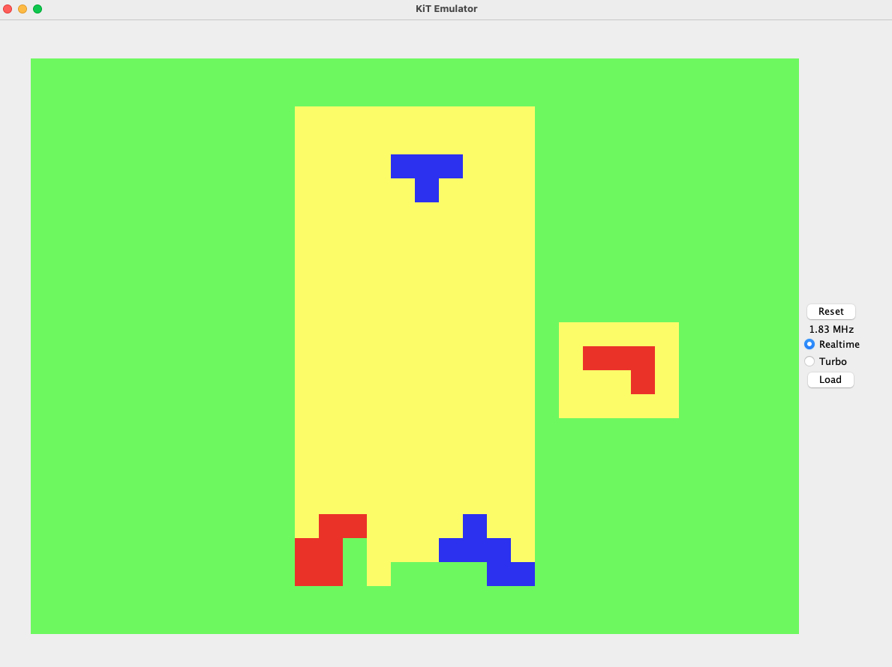

Ok, I'm a bit behind on these posts.... I actually started writing this emulator in December 2022, in preparation for teaching a class in Java at Carleton. Since then, it's become a nearly full replica of the KiT 2 (with the exception of the sound card--to be discussed in a future post). I would call it [partially cycle-accurate](https://emulation.gametechwiki.com/index.php/Emulation_accuracy); the emulator tracks how many cycles each instruction takes, but doesn't resolve within-cycle timings. It supports almost every 65C02 instruction, with the exceptions of STP, WAI, TSB, and TRB (which I've never used, although it would be easy to add support for them). I referred to [this great resource](https://www.masswerk.at/6502/6502_instruction_set.html) on the 6502 instruction set very often while writing the emulator, as well as [this page](http://www.6502.org/tutorials/65c02opcodes.html) on the 65C02 instruction set (which adds a few instructions and has slightly different cycle counts). 

The major components I'm emulating are the CPU, RAM, ROM, SSD, graphics card, PS2 keyboard interface, UART, and VIAs. The components talk to each other through a `Bus` class, which they can write data to and read data from. Here's the core of the emulation loop, omitting some details:

```java
while (true) {
    if (doReset) {
        // reset everything
    } 

    currTime = System.nanoTime();

    // Execute next instruction
    cpu.step();

    // Simulate execution time
    cycleCount = cpu.getCycleCount();
    newCycles = (int)(cycleCount - prevCycleCount);
    nsElapsed = 480 * newCycles;
    while ((System.nanoTime() - currTime) < nsElapsed) { 
        continue;
    }

    prevCycleCount = cycleCount;

    // VIA timers need to know how many cycles have elapsed
    via1.updateCycleCount(newCycles);
    via2.updateCycleCount(newCycles);
}
```

The `CPU` class looks roughly as follows:

```java
// registers
public class CPU {
    abstract class Instruction {
        int opcode;
        int bytes;
        int cycles;
        String mnemonic;
        AddressingMode addrMode;

        public abstract void exec();

        // ...

    }

    // all the instructions

    // registers
    private int PC;
    private int A;
    private int X;
    private int Y;
    private int S;

    // flags
    private boolean C;
    private boolean N;
    private boolean Z;
    private boolean V;
    private boolean I;
    private boolean D;

    private Bus bus;
    private Instruction[] instructions;
    private long cycleCount;

    // ...

    public void step() {
    if (bus.getIRQ() && !I) {
        doIRQ(false);
    } else {
        int opcode = bus.read(PC);
        Instruction inst = this.instructions[opcode];
        cycleCount += inst.cycles;
        inst.exec();
    }

}

```

Here's what a typical instruction looks like. I usually have an abstract class for a collection of instructions (to maximize code reuse), with concrete subclasses for each addressing mode (which each have their own opcodes and cycle counts):

```java
 abstract class LDA extends Instruction {
    LDA(String mnemonic, CPU.AddressingMode addrMode, int opcode, int bytes, int cycles) {
        super(mnemonic, addrMode, opcode, bytes, cycles); 
    }

    public void exec() {
        A = getLoadVal(this.addrMode);  // getLoadVal reads from the bus according to the addressing mode (and increments the PC accordingly)
        updateNZ(A);                    // updates the N and Z flags according to the newly loaded value
        incPC();                        // increment the program counter
    }
}

class LDAImmediate extends LDA {
    LDAImmediate() {
        super("lda", AddressingMode.IMMEDIATE, 0xA9, 2, 2);
    }
}

// all the other addressing modes for LDA ...
```

It was pretty amazing to go from coding up the effects of each instruction on each register and flag to a running computer. Here's what the emulator currently looks like:



The emulator will run all the programs I've written for the KiT, including the Mandelbrot generator:



It also supports several of the graphics modes my graphics card uses (although not all of them--I haven't bothered implementing the modes I don't use). Here's the high resolution two-color mode:



I've been using the emulator to help speed up iterative development, which was really helpful in implementing Tetris:




As you can see in the screenshots, the emulator supports "Turbo" mode, which skips the busy-waiting loop for maximum speed. It usually reaches 30-35 MHz in Turbo mode on my 2018 MacBook Pro, meaning my emulator is efficient enough to run at nearly 20x native speed!

If you want to run the KiT yourself or even write some 6502 code for it, now you can! The emulator is publicly available at [https://github.com/tomlinsonk/kit-emu](https://github.com/tomlinsonk/kit-emu).


### Previous post: [Part 6]() <!-- <span style="float:right">Next post: [Part 8]()</span> -->

