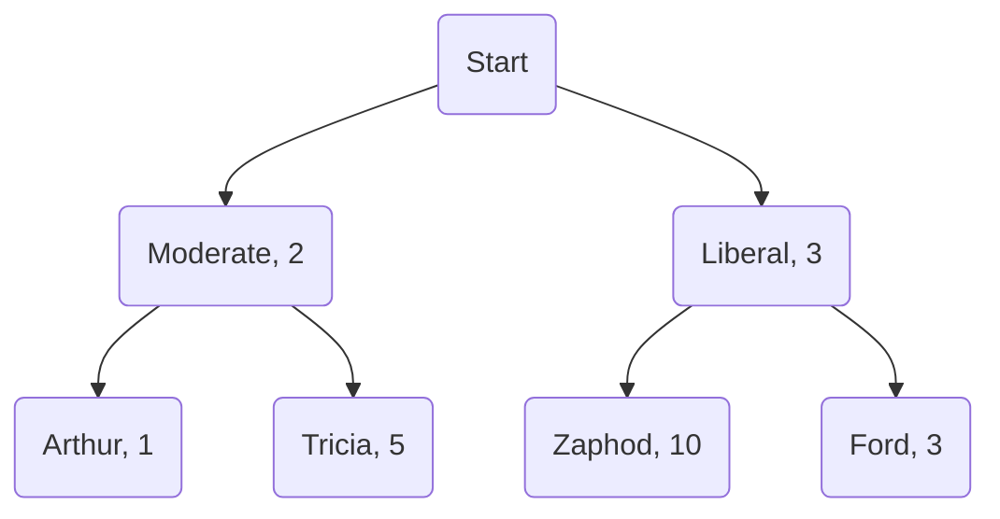

*Choosing* is one of the most common and important actions people take: we choose where to work, how to get there, who to vote for, and what to have for lunch. These scenarios are studied in economics, psychology, and (recently) computer science under the umbrella of "discrete choice" (as opposed to continuous choices, like how much milk to put in your coffee). In a discrete choice setting, we're presented with a set of options (the *choice set*) and we make a selection from the available items. Models describing how people make discrete choices have been studied since the '70s (by McFadden[^1] [^2] and Tversky[^3], most notably). Here, I'll grive a brief introduction to discrete choice models and lead up into my recent work with Austin Benson (edit: now accepted at ICML 2020).

### IIA and Plackett-Luce
The most basic choice model is the Plackett-Luce model, under which the probability that someone picks an item $x$ from the choice set $C$ is proportional to the *utility* $u_x$ of $x$ (some quantity describing its value to the chooser):

$$\Pr(x \mid C) = \frac{u_x}{\sum_{y \in C} u_y}.$$

This model can be derived from a seemingly reasonable assumption about choice, *the independence from irrelevant alternatives* (IIA), also called Luce's choice axiom[^4]. IIA states that the relative probabilities of picking items do not depend on the other items in the choice set. Formally, IIA holds if for all items $x, y$ that appear in both the choice sets $C$ and $C'$, 

$$\frac{\Pr(x \mid C)}{\Pr(y \mid C)} = \frac{\Pr(x \mid C')}{\Pr(y \mid C')}.$$

For instance, if I prefer pizza to hot dogs, then I should still prefer pizza to hot dogs when you tell me that hamburgers are also available.

### Multinomial logit
A slight variant of the Plackett-Luce model is the *multinomial logit model* (MNL), in which choice probabilities are proportional to the exponentials of item utilities:

$$\Pr(x \mid C) = \frac{e^{u_x}}{\sum_{y \in C} e^{u_y}}.$$

In machine learning, this would be called a *softmax* over item utilities. From an economic perspective, the MNL model has a nice property: if people draw random utilities from Gumbel distributions with means $u_x$ before picking the item with maximum observed utility, then the induced choice probabilities are exactly the MNL model. In other words, MNL is consistent with the economic principle that people are utility-maximizers. From a computer science persepctive, however, the more important thing is that we can learn maximum-likelihood utilities from observed choices since the log-likelihood function is convex.

### Context effects
While IIA is intuitively satisfying and leads to simple models, it often doesn't hold in practice (see, e.g., seminal work by Tversky and Kahneman[^5] and Tversky and Simonson[^6]). For instance, similar items sometimes *cannibalize* each other. Every presidential election cycle, we are reminded of the unfortunate phenomenon of vote-splitting (this motivates voting systems better than first-past-the-post, but that's for another post). This is an example of an IIA violation: if 50% of people vote liberal and 50% vote moderate, then one candidate from each category would tie against each other. However, introduce one more liberal and the votes may look like 25%, 25%, 50%. These phenomena are termed *context effects*. Another common context effect is the *compromise effect*, which describes the tendency for people to choose intermediate options from the choice set (the classic example is that people tend to buy the middle-priced bottle of wine given three options). 

### Nested logit
Many alternative discrete choice models have been introduced to account for context effects. One is the *nested logit* (NL) model, which is designed to account for the type of cannibalization described above. In a nested logit model, the items are the leaves of a tree whose internal nodes represent categories of items. Every node in the tree has an associated utility. For example:

To choose in the NL model, you start at the root and repeatedly choose from the children of the current node according to an MNL model until reaching a leaf. In the NL instance above, the probability that I would vote for Zaphod is $$\frac{e^3}{e^2 + e^3} \cdot \frac{e^{10}}{e^{10} + e^3} \approx 73\\%.$$ Like MNL, nested logit utilities can be efficiently inferred from choice data (inferring the correct tree structure is an open problem---people typically design possible trees by hand and use hypothesis testing).

### CDM
Another interesting discrete choice model is the *context-dependent random utility model* (CDM) recently introduced by Seshadri, Peysakhovich, and Ugander[^7]. This model is based on the idea that context effects can be approximated by pairwise interactions. That is, the utility of item $x$ in choice set $C$ depends on an intrinsic value term plus the effect of every other item in $C$ on $x$. In principle, the context effects exerted by the pair of items $\\{w, y\\}$ could be unrelated to the effects of $w$ and $y$ individually, but this approximation seems to be pretty good in practice. 

In the CDM, each item still has a utility $u_x$. In addition, every pair of distinct items $x, y$ has an associated *pull* $p_{xy}$, which decribes the pull of $x$ on $y$'s utility (this notation differs slightly from the CDM paper). The choice probabilities are then:

$$\Pr(x \mid C) = \frac{\exp\left(u_x + \sum_{z\in C \setminus x} p_{zx}\right)}{\sum_{y \in C} \exp \left(u_y + \sum_{z\in C \setminus x} p_{zy}\right)}$$

Although it is considerably more complex, the CDM can still be efficiently learned from data! It also outperforms the MNL model in describing real-world choice datasets. I've found it very applicable as a powerful general choice model accounting for context effects that can be learned from data.

### Vector parametrization
All of these choice models can be augmented by replacing fixed utilities with (possibly latent) feature and preference vectors. This has several advatanges, including learning relationships between similar items and between people with similar preferences. Suppose we want to model the choices of many individuals. We'll denote the probability that person $a$ picks item $x$ given choice set $C$ using $\Pr(a \gets x \mid C)$. For MNL, suppose we have embedding vectors $\alpha_a$ for each person and vectors $\beta_x$ for each item. Then we can say the utility of an item to an agent is the inner product of their vectors:

$$\Pr(a\gets x \mid C) = \frac{e^{\alpha_a^T \beta_x}}{\sum_{y\in C} e^{ \alpha_a^T\beta_y }}.$$

Learning parameters from choice data then gives us low-dimensional embeddings of people and items. For the CDM, even the single-individual case is interesting. If you think about the placing the parameters $p_{zx}$ in a utility-adjusted matrix $P_{zx} = p_{zx}-u_x$ (with zeros on the diagonal), then we can find a low-rank approximation where each entry $P_{zx}$ is approximated by the inner product of two low-dimensional vectors $c_z$ and $t_z$. This is exactly the low-rank CDM:

$$\Pr(x \mid C) = \frac{\exp\left(\left(\sum_{z \in C \setminus x} c_z\right)^T t_x \right)}{\sum_{y \in C}\exp\left(\left(\sum_{z \in C \setminus y} c_z\right)^T t_y \right)}.$$

### My recent work
I'll now give a quick teaser for my [recent paper with Austin](). If a group of people are choosing between a set of options, one natural quantity is the amount of *disagreement* in the group, or the sum of differences in choice probabilities:

$$\sum_{a, b} \sum_{x \in C} \left| \Pr(a\gets x \mid C) - \Pr(b\gets x \mid C) \right|.$$

One simple intervention we can make is to introduce additional items to the choice set, and we might wish to shrink the initial disagreement (to encourage consensus or to help the group reach a final decision). Thus, one of the problems we study is finding the set of items $Z$ that minimizes

$$D(Z) = \sum_{a, b} \sum_{x \in C} \left| \Pr(a\gets x \mid C \cup Z) - \Pr(b\gets x \mid C \cup Z) \right|.$$

This problem turns out to be quite hard: NP-hard, in fact, under all of the choice models discussed above. Another problem we consider is optimizing for the number of individuals whose favorite item is some target $x^\*.$ This also turns out to be NP-hard when context effects are present, but it appears to be an easier problem than minimmizing disagreement in the sense that restricting these choice models can make promotion easy while leaving agreement hard. 

In addition to showing these problems hard, our paper also provides a general-purpose approximation algorithm for choice set optimization problems in the MNL model (with extensions for the CDM and NL models). If you're interested, more details are available in the paper linked above.

[^1]: McFadden, D. Conditional logit analysis of qualitative choice behavior. In Zarembka, P. (ed.), *Frontiers in Econometrics*, pp. 105–142. Academic Press, 1974.
[^2]: McFadden, D. Modeling the choice of residential location. *Transportation Research Record*, (673), 1978.
[^3]: Tversky, A. Elimination by aspects: A theory of choice. *Psychological Review*, 79(4):281, 1972.
[^4]: Luce, R. D. Individual choice behavior. 1959.
[^5]: Tversky, A. and Kahneman, D. The framing of decisions and the psychology of choice. *Science*, 211(4481):453– 458, 1981.
[^6]: Tversky, A. and Simonson, I. Context-dependent preferences. Management Science, 39(10):1179–1189, 1993.
[^7]: Seshadri, A., Peysakhovich, A., and Ugander, J. Discovering context effects from raw choice data. In *International Conference on Machine Learning*, pp. 5660–5669, 2019.

