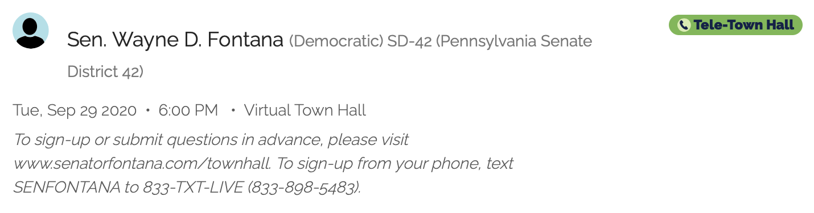

*Update: I'm sure this no longer works given the changes to the Twitter API, not to mention the [absurd cost](https://www.theverge.com/2023/3/30/23662832/twitter-api-tiers-free-bot-novelty-accounts-basic-enterprice-monthly-price). [Sad](https://www.vox.com/culture/2022/11/22/23466381/leaving-twitter-x-saying-goodbye-social-media).*

I recently revisited a project from last year and thought it would be fun to write about my experience with it. My girlfriend Sophia volunteers for the [Town Hall Project](https://townhallproject.com), a non-partisan organization that helps connect engaged citizens with their representatives by making it easy to find information on town halls and office hours. Many legislators hold meetings with their constituents, but it can be difficult to hear about them (maybe the meeting times are posted on a website or perhaps just announced on Twitter). Volunteers for the Town Hall Project spend time searching through individual Facebook pages and Twitter feeds for mentions of town halls. 

To cut down on the time she was spending looking up 40 state senators' Twitters, Sophia asked if there was a way to get automatic Twitter notifications when one of her assigned legislators tweeted about a town hall. I thought there must be some existing way of doing this--of course, there are a million services that offer Twitter alerts. Here's a small sample: [Warble](https://warble.co), [MyTweetAlerts](https://www.mytweetalerts.com), [Twilert](https://twilert.com). However, many of these existing tools are paid services or didn't do quite what we wanted. In particular, she wanted a daily digest including every relevant tweet from any of her monitored accounts since the last digest. Here's a sample alert email my script sent from a few days ago:

>There were 2 flagged tweets:
>
>Wayne D. Fontana (2020-09-02 17:47:52)<br>
>Join me Sept. 29 at 6pm for a Tele-Town Hall on voting. I'll be joined by PA Secretary of State Kathy Boockvar &amp; @ACE_Fitzgerald to answer questions related to the voting process in PA &amp; Allegheny County leading up to the Nov. 3 general election. https://t.co/ojYLaf9skP<br>
>https://twitter.com/WayneDFontana/status/1301215280585150466
>
>Senator John DiSanto (2020-09-01 21:37:03)<br>
>Consider joining my live Telephone Town Hall, Wed, Sept. 2,  6-7 p.m. to hear about &amp; discuss state issues impacting you &amp; your family from the comfort &amp; safety of your own home. Sign up at https://t.co/N6yUl4SksL so you receive a call, or listen to the livestream.<br>
>https://twitter.com/SenatorDiSanto/status/1300910567536971786

Here's the entry on the Town Hall Project website (submitted by Sophia after receiving the alert) for the first one:


As someone who had no previous experience working with the the Twitter API or sending emails through a Python script, it was an interesting project. The first step was figuring out how to fetch all tweets from an account since the previous day. The Twitter API handle for fetching tweets from an account is [GET statuses/user_timeline](https://developer.twitter.com/en/docs/twitter-api/v1/tweets/timelines/api-reference/get-statuses-user_timeline), which can be easily done in Python using [this Tweepy function](http://docs.tweepy.org/en/v3.5.0/api.html#API.user_timeline). However, this GET request returns a maximum of 200 tweets, and I wanted the script to be robust as possible (even to Twitter-fiend senators). So, I store the ID of the last processed tweet for each tracked user in a file and make requests in chunks of 200 until reaching the last processed tweet. Here's a code snippet:

```python
def get_tweets(account, last_tweet_ids):
    auth = tweepy.OAuthHandler(CONSUMER_KEY, CONSUMER_SECRET)
    auth.set_access_token(ACCESS_TOKEN, ACCESS_TOKEN_SECRET)
    api = tweepy.API(auth)

    new_tweets = api.user_timeline(screen_name=account, count=200, 
                                   tweet_mode='extended') 
    all_tweets = [tweet for tweet in new_tweets 
                  if not tweet.retweeted and tweet.id > last_tweet_ids[account]]

    oldest_id = tweets[-1].id - 1
    while oldest_id > last_tweet_ids[account] and len(new_tweets) > 0:
        older_tweets = api.user_timeline(screen_name=account, count=200, 
                                         max_id=oldest_id, tweet_mode='extended')  
        all_tweets.extend([tweet for tweet in older_tweets
                           if not tweet.retweeted 
                              and tweet.id > last_tweet_ids[account]])
        oldest_id = tweets[-1].id - 1
    return all_tweets
```
(It was very easy to [apply for API access](https://developer.twitter.com/en/apply-for-access) and get the necessary credentials: `CONSUMER_KEY`, `CONSUMER_SECRET`, `ACCESS_TOKEN`, `ACCESS_TOKEN_SECRET`.)

Then, it's a simple matter of picking out which tweets to flag. Once that's done, sending an email can be done with [smtplib](https://docs.python.org/3/library/smtplib.html) and [email](https://docs.python.org/3/library/email.examples.html):
```python
def send_alert(flagged_tweets):
    message = f'There were {len(flagged_tweets)} flagged tweets:\n'
    for tweet in sorted(flagged_tweets, key=lambda x: x.created_at, reverse=True):
        message += f'\n{tweet.user.name} ({tweet.created_at})\n{tweet.full_text}\n' \
            f'https://twitter.com/{tweet.user.screen_name}/status/{tweet.id}\n'

    msg = email.mime.text.MIMEText(message, _charset='UTF-8')
    msg['Subject'] = email.header.Header(SUBJECT_LINE, 'utf-8')

    server = smtplib.SMTP_SSL('smtp.gmail.com', 465)
    server.login(ALERT_FROM_EMAIL, ALERT_FROM_PASSWORD)
    server.sendmail(ALERT_FROM_EMAIL, ALERT_TO_EMAIL, msg.as_string())
    server.quit()
```

We made a Gmail account dedicated to sending these emails (`ALERT_FROM_EMAIL`). I added a couple of error-handling measures (for instance, you get a `tweepy.error.TweepError` if the `screen_name` does not exist--this error actually happened to me in the last year when a [state senator](https://en.wikipedia.org/wiki/Mike_Folmer) was arrested and his Twitter account was deleted).

The last step was getting the script to run every day, which is easy with [cron](https://help.ubuntu.com/community/CronHowto). Here's a <a href="townhall_alerts.txt" download>download link</a> for the full script (with passwords and keys removed; annoyingly, this server doesn't want to allow .py file downloads, so I've renamed it .txt).


