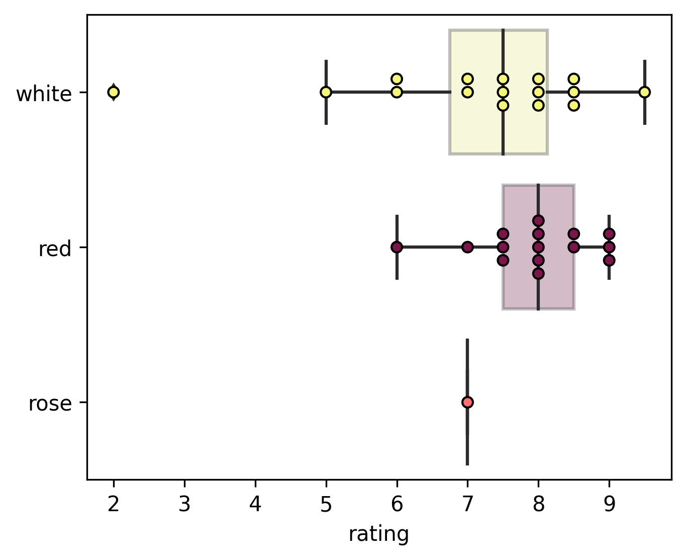
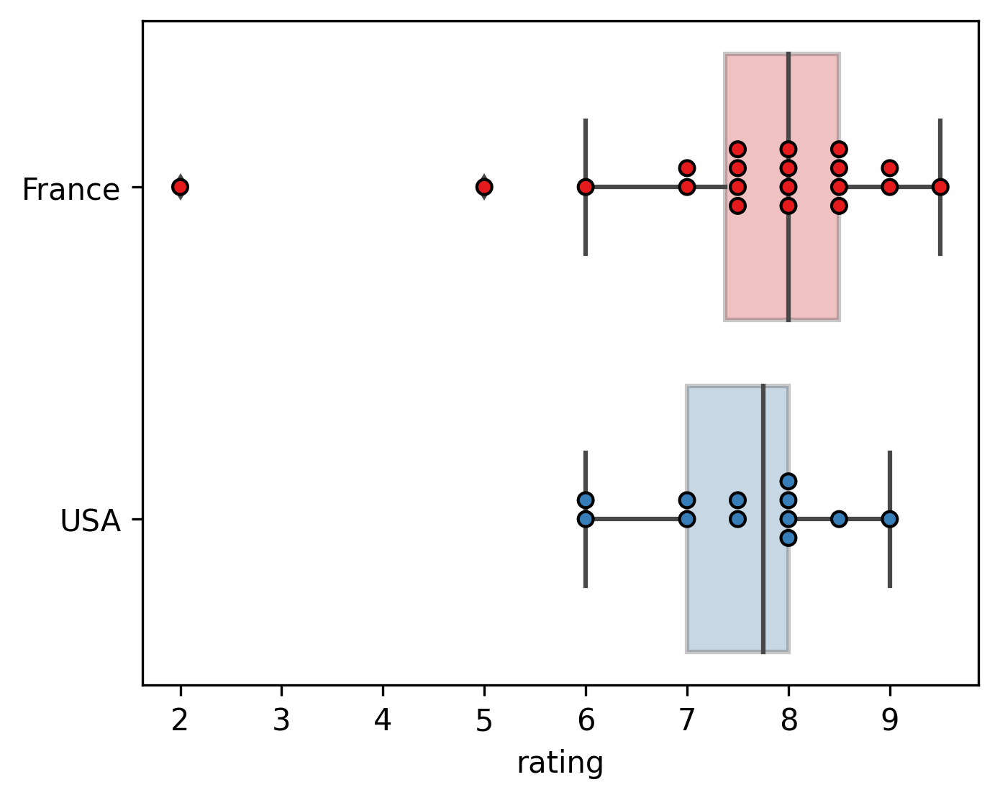
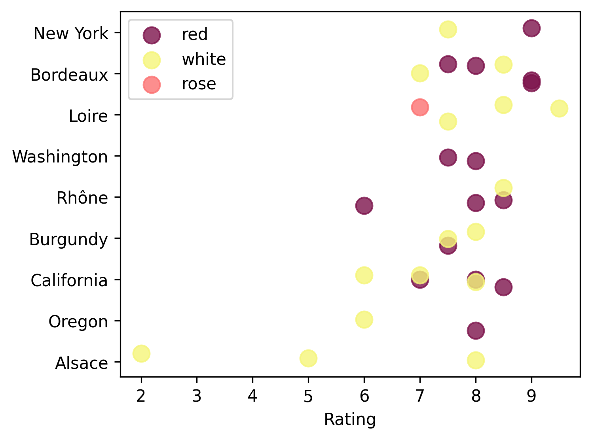
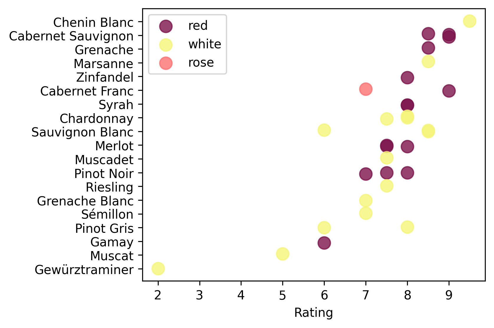
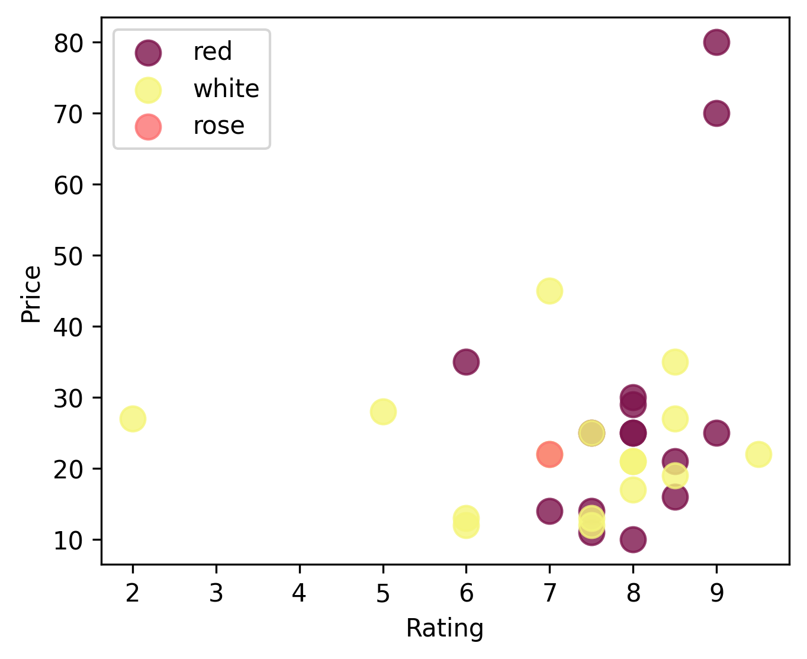
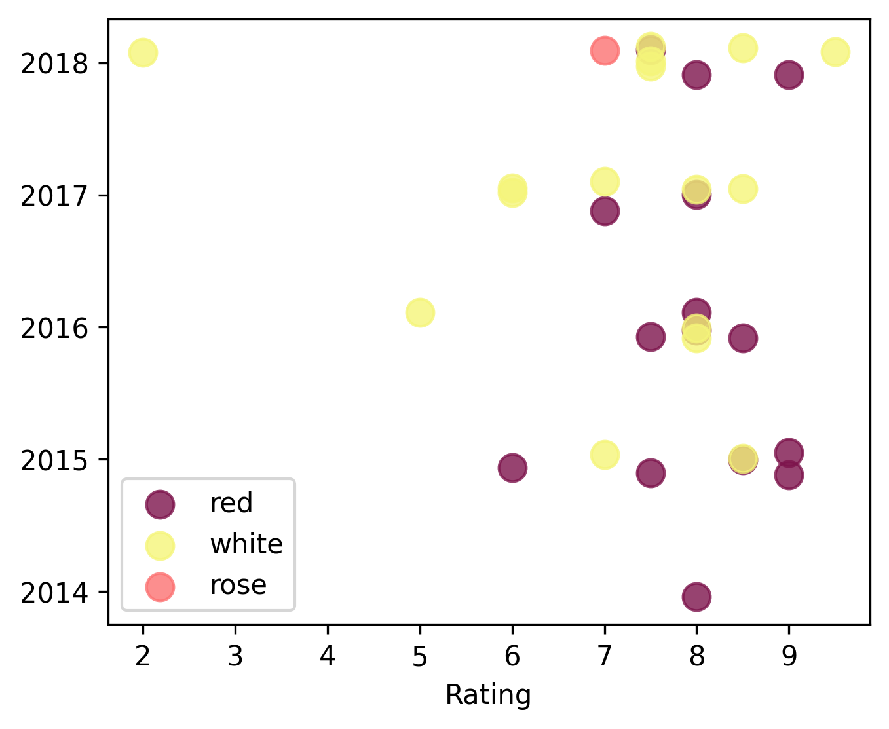

Before the semester went fully online due to COVID, I had a lot of fun tasting wines in [HADM 4300: Introduction to Wines](https://cornellsun.com/2019/10/10/inside-two-of-cornells-biggest-classes-wines-and-oceanography/). As part of the class, we tasted about six wines each week and recorded notes on them, including a 1-10 rating. Before leaving the class, I tasted and rated 32 wines from the US and France (they covered other regions later). After finding my notes from that semester, I thought it would be fun to do a bit of data analysis. 

## The big questions: White or red? France or USA?
<table>
<thead><tr>
<td> 
  

    
     
    <b>Figure 1: Ratings by color</b>
  
 
</td>
<td> 
  

    
     
    <b>Figure 2: Ratings by country</b>
  
 
</td>
</tr></thead></table>

I tended to prefer reds to whites and (ever so slightly) French wines to US wines. However, with such a small dataset, the differences are not statistically significant (t-test p-values of 0.12 and 0.97 for red/white and France/USA).

## A closer look: Regions and varieties
<table>
<thead><tr>
<td> 
  

    
     
    <b>Figure 3: Ratings by region</b>
  
 
</td>
<td> 
  

    
     
    <b>Figure 4: Ratings by dominant variety</b>
  
 
</td>
</tr></thead></table>

Unsurprisingly, I liked [Bordeaux reds](https://en.wikipedia.org/wiki/Château_Langoa-Barton) (Cabernet Sauvignon over Merlot) and [Loire whites](http://mmdusa.net/portfolio/marc-bredif). Perhaps somewhat more surprising is New York topping the average rating list, thanks to a really great [Long Island Cabernet Franc](https://liebcellars.com) and a pretty good [Finger Lakes Riesling](https://www.clrwine.com). Je suis vraiment désolé, Alsace, but I really didn't like the funkiness of the [Gewürztraminer](http://www.zindhumbrecht.fr/en/) and [Muscat](https://www.kermitlynch.com/our-wines/domaine-ostertag/) we tried. My favorite wine was a [Loire Chenin Blanc](http://mmdusa.net/portfolio/marc-bredif), the only 9.5 I gave.

## Other factors: Price and vintage

<table>
<thead><tr>
<td> 
  

    
     
    <b>Figure 5: Rating vs price</b>
  
 
</td>
<td> 
  

    
     
    <b>Figure 6: Ratings by year</b>
  
 
</td>
</tr></thead></table>

I don't seem to have any particular preference for year or be influenced much by price (I gave all ratings price-blind). The Pearson correlation between price and rating is 0.19 (p=0.29).  However, the two most expensive wines we tasted were both fantastic: [Château Langoa Barton](https://en.wikipedia.org/wiki/Château_Langoa-Barton) and [Château Pédesclaux](https://en.wikipedia.org/wiki/Château_Pédesclaux).

## Conclusions
- Try more Chenin Blanc
- When in doubt, go for a Bordeaux Cabernet Sauvignon 
- Need more data!

## Raw data
In decending rating order:

| Name | Rating | Year | Region | Dominant Variety | Color | Price |
| :- |  -: |  -: |  :- |  :- |  :- |  -: | 
|                  Marc Brédif Classic  |   9.5 | 2018 |      Loire |       Chenin Blanc  | white  |   $22 |  
|                  Lieb Cellars Estate  |   9.0 | 2018 |   New York |     Cabernet Franc  |   red  |   $25 |
|                Château Langoa Barton  |   9.0 | 2015 |   Bordeaux | Cabernet Sauvignon  |   red  |   $80 |
|                   Château Pédesclaux  |   9.0 | 2015 |   Bordeaux | Cabernet Sauvignon  |   red  |   $70 |
|                         Vidal-Fleury  |   8.5 | 2015 |      Rhône |           Marsanne  | white  |   $35 |
|                  Château de Sancerre  |   8.5 | 2017 |      Loire |    Sauvignon Blanc  | white  |   $27 |
|             Château Graville-Lacoste  |   8.5 | 2018 |   Bordeaux |    Sauvignon Blanc  | white  |   $19 |
|          André Brunel Côtes du Rhône  |   8.5 | 2016 |      Rhône |           Grenache  |   red  |   $16 |
|                         Picket Fence  |   8.5 | 2015 | California | Cabernet Sauvignon  |   red  |   $21 |
|     Barton & Guestier  Saint-Émilion  |   8.0 | 2016 |   Bordeaux |             Merlot  |   red  |   $25 |
|                      Cline Old Vine   |   8.0 | 2017 | California |          Zinfandel  |   red  |   $10 |
|  Domaine Philippe & Vincent Jaboulet  |   8.0 | 2014 |      Rhône |              Syrah  |   red  |   $30 |
|          Gramercy Cellars Lower East  |   8.0 | 2016 | Washington |              Syrah  |   red  |   $25 |
|         Frei Brothers Sonoma Reserve  |   8.0 | 2017 | California |         Chardonnay  | white  |   $17 |
|             Maison Champy Cuvée Edme  |   8.0 | 2016 |   Burgundy |         Chardonnay  | white  |   $21 |
|                        Hugel Classic  |   8.0 | 2016 |     Alsace |         Pinot Gris  | white  |   $21 |
|       Patricia Green Cellars Reserve  |   8.0 | 2018 |     Oregon |         Pinot Noir  |   red  |   $29 |
|     Louis Jadot Couvent des Jacobins  |   7.5 | 2015 |   Burgundy |         Pinot Noir  |   red  |   $25 |
|          Pieuré St.-Flaurent Réserve  |   7.5 | 2018 |   Bordeaux |             Merlot  |   red  |   $11 |
|                  Louis Jadot Chablis  |   7.5 | 2018 |   Burgundy |         Chardonnay  | white  |   $25 |
|                      Columbia Winery  |   7.5 | 2016 | Washington |             Merlot  |   red  |   $14 |
|         Chateau LaFayette Reneau Dry  |   7.5 | 2018 |   New York |           Riesling  | white  |   $13 |
|        Clos de la Sénaigerie Sur Lie  |   7.5 | 2018 |      Loire |           Muscadet  | white  |   $12 |
|                     Château de Myrat  |   7.0 | 2015 |   Bordeaux |           Sémillon  | white  |   $45 |
|                    Margerum M5 White  |   7.0 | 2017 | California |     Grenache Blanc  | white  |   $22 |
|                       Charles Joguet  |   7.0 | 2018 |      Loire |     Cabernet Franc  |  rose  |   $22 |
|                 Tarrica Wine Cellars  |   7.0 | 2017 | California |         Pinot Noir  |   red  |   $14 |
|        Sterling Vintner’s Collection  |   6.0 | 2017 | California |    Sauvignon Blanc  | white  |   $12 |
|                            Rainstorm  |   6.0 | 2017 |     Oregon |         Pinot Gris  | white  |   $13 |
|          Domaine de Fa Roche Guillon  |   6.0 | 2015 |      Rhône |              Gamay  |   red  |   $35 |
|            Domaine Ostertag Fronholz  |   5.0 | 2016 |     Alsace |             Muscat  | white  |   $28 |
|               Domaine Zind-Humbrecht  |   2.0 | 2018 |     Alsace |     Gewürztraminer  | white  |   $27 |
